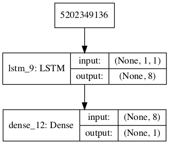

# LSTM airline passengers prediction
Recurrent Neural Network(LSTM) by using Keras in Python for airline passengers prediction
## 数据
这里使用1949-1960年的每年航空总人数作为数据来预测1961年一个月的乘客总数。该数据共144个数据，单位是1000，这个是从国际航空公司的网站上下载下来的，原始数据在这里[1946-1960国际航空乘客数](https://datamarket.com/data/set/22u3/international-airline-passengers-monthly-totals-in-thousands-jan-49-dec-60#!ds=22u3&display=line)。
我们的目标是预测国际航班未来1个月的乘客数

## 数据预处理
这里的数据是csv格式的首先我们要将数据读取进来，我们这里只保留乘客总数目不保留日期信息。
```
dataframe=pd.read_csv('data/international-airline-passengers.csv',usecols=[1])
```
数据读取如下表所示这些都是整形的数字。
```
	International airline passengers: monthly totals in thousands. Jan 49 ? Dec 60
0	112
1	118
2	132
3	129
4	121
5	135
6	148
7	148
8	136
9	119
20	158
21	133
22	114
23	140
24	145
25	150
26	178
27	163
28	172
29	178
...	...
141	461
142	390
143	432
144 rows × 1 columns
```
接下来我们我要将这些整形数据转换为浮点数据以便以后送进神经网络中进行学习，这里可以通过pandas提供的相关工具进行转换一下即可。

```
dataset=dataframe.values #将整形数字转换为数组
dataset=dataset.astype('float32')
```
这里可以看下转换后图片的形状
```
dataset.shape
```
(144,1)

这里可以将数据可视化一下来看一下整体的数据分布情况。
```
import matplotlib.pyplot as plt
plt.plot(dataset)
plt.show()
```


从上图中我们也可以看出乘客数目还是有一定的规律每年的旺季和淡季也可以很清楚的看出来
### 数据标准化
**接下来就是重中之重了，我们清楚神经网络都喜欢小数据，比较喜欢0-1数值之间的数值，不然大数据也是出力不讨好的事。不仅加大了网络的计算量同时也会出现不能收敛的情况，尤其对sigmoid或者tanh激活函数这类激活函数。所以这里我们就将数据统一规划到均值为0方差为1，也就是标准化**

```
from sklearn.preprocessing import MinMaxScaler
scaler=MinMaxScaler(feature_range=(0,1))#使用sklearn工具将属性缩放到(0,1)之间的值
dataset=scaler.fit_transform(dataset)
```
通过上述操作数据就重新分布到(0,1)之间的数值
```
array([[0.01544402],
       [0.02702703],
       [0.05405405],
       [0.04826255],
       [0.03281853],
       [0.05984556],
       [0.08494208],
       [0.08494208],
       [0.06177606],
       [0.02895753],
       ....
       [0.44980695],
       [0.49420849],
       [0.45945946],
       [0.58301158],
       [0.56370656],
       [0.61003861],
       [0.71042471],
       [0.85714286],
       [0.87837838],
       [0.69305019],
       [0.58494208],
       [0.4980695 ],
       [0.58108108],
       [0.6042471 ],
       [0.55405405],
       [0.60810811],
       [0.68918919],
       [0.71042471],
       [0.83204633],
       [1.        ],
       [0.96911197],
       [0.77992278],
       [0.68918919],
       [0.55212355],
       [0.63320463]])  
```
### 数据集划分

由于数据较少这里就不划分验证集了，我们这里采用黄金分割点的方式进行数据集划分即将67%的数据作为测试数据，剩下的33%作为测试数据

``` 
train_size=int(len(dataset)*0.67)

test_size=len(dataset)-train_size

train,test=dataset[0:train_size,:],

dataset[train_size:len(dataset),:]
```
我们这里要定义一个生成样本的函数，将数据存储为两个矩阵，一个矩阵的ind位置存储t时刻的值，另一个矩阵存储t+1时刻的值。

``` import numpy as np
def create_dataset(dataset,look_back=1):
    dataX,dataY=[],[]
    for i in range(len(dataset)-look_back-1):
        dataX.append(dataset[i:(i+look_back),0])
        dataY.append(dataset[i+look_back,0])
    return np.array(dataX),np.array(dataY)
```
这里我们并没有将最后一个数据参与进来，这是为我们预测1961的1月份的数据做准备的。

**接下来就要解释为什么这么划分数据集,这里是基于历史数据预测下一个时刻的数据，这里需要决定每次依赖多少历史数据，这里设置参数look_back=1设置的历史数据为1，也就是基于前一个月数据预测下一个月份的数据。这里我们以前一个月的值预测下一个月的乘客数，预测下一个月的值会有偏差，当然这也是是我们神经网络要做的，后面我们会用均方根误差来衡量模型真实输出和这个值得差距。但是测试数据没有必要这样划分，因为他不需要标签，这里分的意思是利用分到的标签用于计算模型在测试数据上的均值根误差**

示意图如下：

上图中蓝色框表示的是训练数据，红色的框是要预测的数据。

数据集创建如下：

```
look_back=1
trainX,trainY=create_dataset(train,look_back)
testX,testY=create_dataset(test,look_back)
```
获得的数据集如下：

```
trainX.shape,testX.shape
```
((94, 1), (46, 1))

**接下来也非常的关键，我们知道神经网络对输入尺寸非常的敏感，对输入尺寸要求非常严格，我么必须调整尺寸后才能送进神经网络进行计算，对于LSTM这种网络是有固定输入格式的[samples,time_steps,features],所以我们必须将数据调整成这样的格式：samples表示的是样本数，time_steps表示的是时间序列，features是样本的特征，这里要做如下的调整**

```
trainX=np.reshape(trainX,(trainX.shape[0],1,trainX.shape[1]))
testX=np.reshape(testX,(testX.shape[0],1,testX.shape[1]))
```

## 构建模型
数据处理完后，接下来就是构建模型了，相比于数据处理构建模型显得就非常简单了，这里设置LSTM网络

```
model=Sequential()
model.add(LSTM(8,input_shape=(1,look_back)))
model.add(Dense(1))
```
**这里的损失函数选择的是mse，经过测试发现mse的效果要远好于mae的效果**

```
model.compile(loss='mean_squared_error',optimizer=RMSprop())
```
这里我们将模型结构可视化一下

```
from keras.utils import plot_model
plot_model(model,to_file='lstm.png',show_shapes=True)
from IPython.display import Image
Image(filename="lstm.png")
```


从上图中我们可以看出模型结构还是非常小的，下面开始训练模型

```
history=model.fit(trainX,trainY,epochs=50,batch_size=1,verbose=1)
```
```
Epoch 1/50
94/94 [==============================] - 2s 18ms/step - loss: 0.0439
Epoch 2/50
94/94 [==============================] - 0s 3ms/step - loss: 0.0204
Epoch 3/50
94/94 [==============================] - 0s 3ms/step - loss: 0.0159
Epoch 4/50
94/94 [==============================] - 0s 2ms/step - loss: 0.0142
Epoch 5/50
94/94 [==============================] - 0s 3ms/step - loss: 0.0127
Epoch 6/50
94/94 [==============================] - 0s 3ms/step - loss: 0.0114
Epoch 7/50
94/94 [==============================] - 0s 2ms/step - loss: 0.0102
Epoch 17/50
94/94 [==============================] - 0s 3ms/step - loss: 0.0026
Epoch 18/50
94/94 [==============================] - 0s 3ms/step - loss: 0.0024
Epoch 19/50
94/94 [==============================] - 0s 3ms/step - loss: 0.0023
Epoch 20/50
94/94 [==============================] - 0s 3ms/step - loss: 0.0022
Epoch 21/50
94/94 [==============================] - 0s 3ms/step - loss: 0.0021
Epoch 22/50
94/94 [==============================] - 0s 3ms/step - loss: 0.0021
Epoch 23/50
94/94 [==============================] - 0s 3ms/step - loss: 0.0020
Epoch 24/50
94/94 [==============================] - 0s 2ms/step - loss: 0.0021
Epoch 25/50
94/94 [==============================] - 0s 3ms/step - loss: 0.0020
Epoch 26/50
94/94 [==============================] - 0s 3ms/step - loss: 0.0020
Epoch 27/50
94/94 [==============================] - 0s 3ms/step - loss: 0.0020
Epoch 28/50
94/94 [==============================] - 0s 2ms/step - loss: 0.0020
Epoch 29/50
94/94 [==============================] - 0s 2ms/step - loss: 0.0020
....
Epoch 49/50
94/94 [==============================] - 0s 3ms/step - loss: 0.0021
Epoch 50/50
94/94 [==============================] - 0s 3ms/step - loss: 0.0020

```
很快就训练完成了，这里将训练曲线ROC可视化一下，通过下面这个函数

```
def draw_roc(history):
    train_loss=history.history['loss']
    epochs=range(0,len(train_loss))
    plt.figure()
    plt.title("Training Loss")
    plt.plot(epochs,train_loss,'r',label='loss')
    plt.legend()
    plt.show()
```
损失曲线如下图所示


从训练曲线中可以看出模型在30次后损失函数值就不在下降了，所以我们可以适当的降低迭代次数

## 验证模型的预测效果
下面我们就用上面训练的模型来检测一下预测的效果

```
trainPredict=model.predict(trainX)
testPredict=model.predict(testX)
```
**这里要注意的是上面预测的结果还是(0,1)之间经过标准化的数值，这些数值对对比实际值是没有意义的，这里必须转换为真实值才能对比出效果，转换为真实值也是非常简单的通过下面的操作**

```
trainY_real=scaler.inverse_transform([trainY])
testY_real=scaler.inverse_transform([testY])
```
这样就把预测的值转换为实际值了

接下来我们计算一下预测出的均方根误差

```
import math
from sklearn.metrics import mean_squared_error 
trainScore=math.sqrt(mean_squared_error(trainY_real[0],trainPredict_real[:,0]))
testScore=math.sqrt(mean_squared_error(testY_real[0],testPredict_real[:,0]))
```
这里得到的trainScore=22.983037，testScore=48.01094
下面将预测的结果可视化一下将会更加直观的感受一下具体的效果

```
trainPredictPlot=np.empty_like(dataset)
trainPredictPlot[:,:]=np.nan
trainPredictPlot[look_back:len(trainPredict_real)+look_back,:]=trainPredict_real

testPredictPlot=np.empty_like(dataset)
testPredictPlot[:,:]=np.nan
testPredictPlot[len(trainPredict_real)+look_back:len(dataset)-3,:]=testPredict_real

**显示图片**
 
plt.plot(scaler.inverse_transform(dataset),color='blue',label='Raw data') 
plt.plot(trainPredictPlot,color='red',label='Train process') 
plt.plot(testPredictPlot,color='green',label='Test process') 
plt.legend(loc='best')
plt.show()
```
效果如下:


从上图中可以看出预测的结果还是很不错的，预测的值和实际都比较的接近。

**我们要预测数据时也要特别的注意，数据是怎么进神经网络训练的也要怎样进神经网络中进行预测，所以这里要进行转换，这里定义一个函数**

```
def model_predict(data):
    predictX=np.reshape(data,(1,1,testX.shape[1]))
    #预测得到标准化数据
    featruePredict=model.predict(predictX)
    #将标准化的数字转换为实际人数
    featruePredict=scaler.inverse_transform(featruePredict)
    return featruePredict
```

还记得我们上面测试集的最后一个值没有使用这里正好那它来进行预测1961年一月份的

```
model_predict(test[-1])
```
array([[416.5474]], dtype=float32)

这就是我们预测的结果
